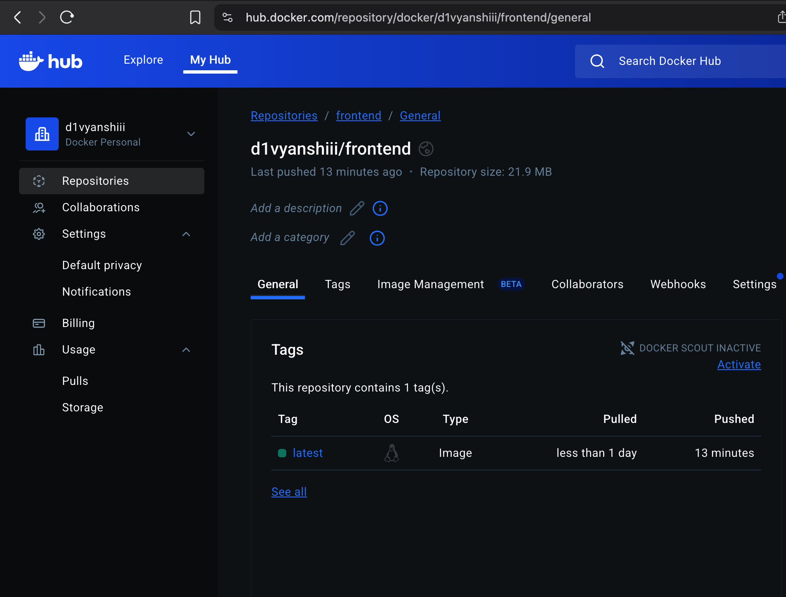
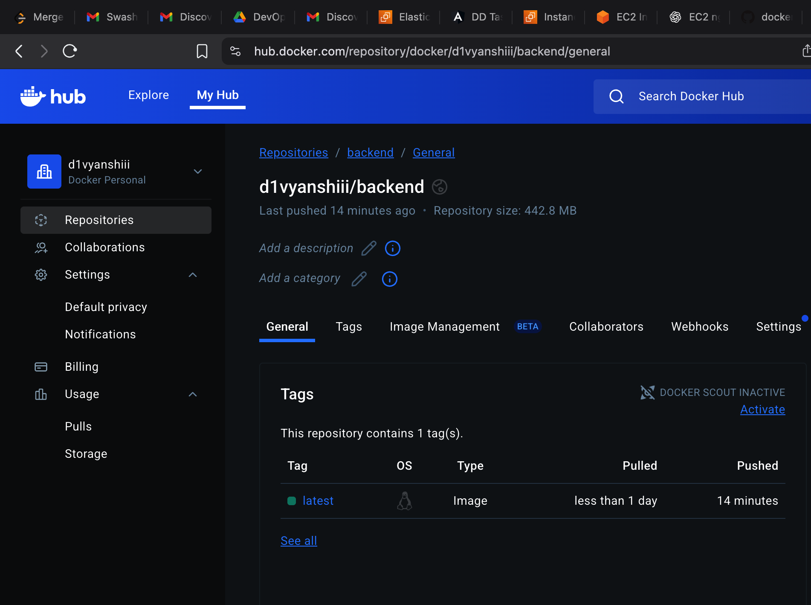
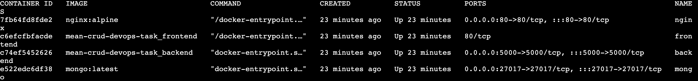
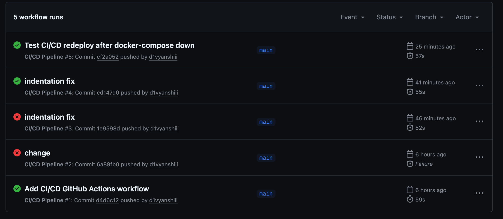
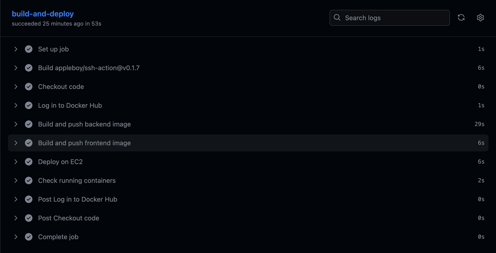
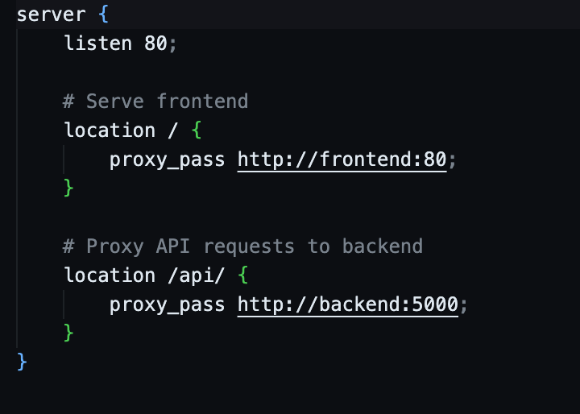
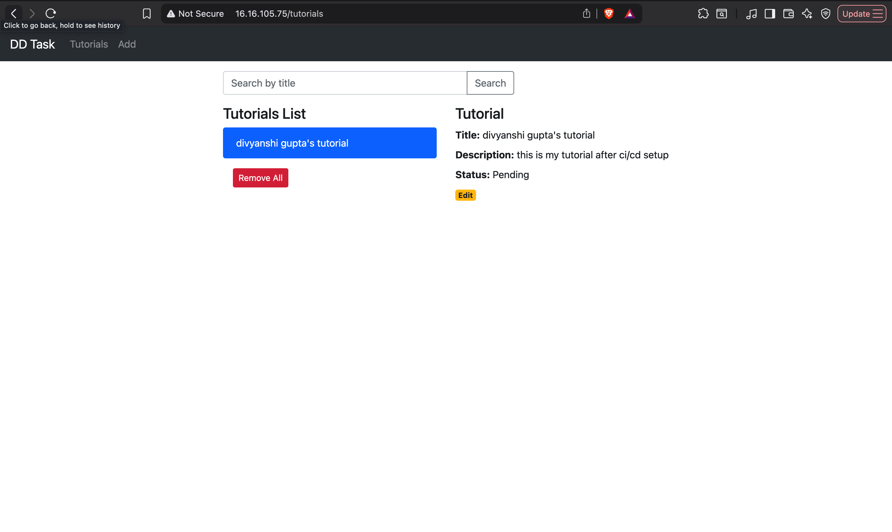
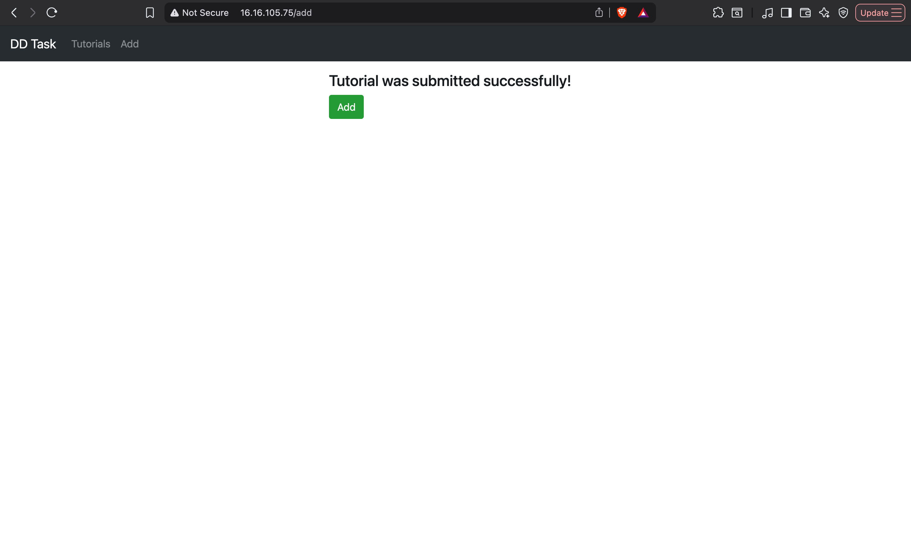

# MEAN CRUD App - DevOps Deployment

This project demonstrates containerization, deployment, and CI/CD for a MEAN CRUD application using **Docker, Docker Hub, GitHub Actions, AWS EC2, MongoDB, and Nginx**.

---

## 📦 Repository Setup

1. Clone the repository:

   ```bash
   git clone https://github.com/<your-username>/mean-crud-devops-task.git
   cd mean-crud-devops-task
   ```

---

## 🐳 Containerization & Deployment

* **Dockerfiles** are created for both **frontend** and **backend**.
* Images are pushed to Docker Hub:

  * Frontend → `d1vyanshiii/frontend:latest`
  * Backend → `d1vyanshiii/backend:latest`
* **Docker Compose** is used to deploy on the EC2 VM.

### 📸 Screenshots to add:




---

## 🗄️ Database Setup

* Using **official MongoDB Docker image** in `docker-compose.yml`.
* This ensures MongoDB runs as a service alongside backend and frontend.

### 📸 Screenshot to add:



---

## 🔄 CI/CD Pipeline

* Configured using **GitHub Actions**.
* On every push to `main`:

  1. Builds Docker images for frontend & backend.
  2. Pushes them to Docker Hub.
  3. SSHs into EC2 and redeploys via Docker Compose.

### 📸 Screenshots to add:




---

## 🌐 Nginx Reverse Proxy

* Configured Nginx on EC2 to route traffic to frontend (and backend via API).
* Entire app is accessible on **port 80** using EC2’s Elastic IP.

### 📸 Screenshots to add:




---

## 📊 Infrastructure Overview

* **AWS EC2 Ubuntu Instance**
* **Docker & Docker Compose**
* **MongoDB via Docker**
* **Nginx as Reverse Proxy**
* **GitHub Actions for CI/CD**

---

## 🚀 Application Demo

### 📸 Screenshot to add:



---

## ✅ Summary

* Dockerized frontend & backend
* MongoDB setup with Docker
* CI/CD pipeline with GitHub Actions
* Deployment on AWS EC2
* Reverse proxy via Nginx
* Fully automated workflow from code push → deployment → running app

---
